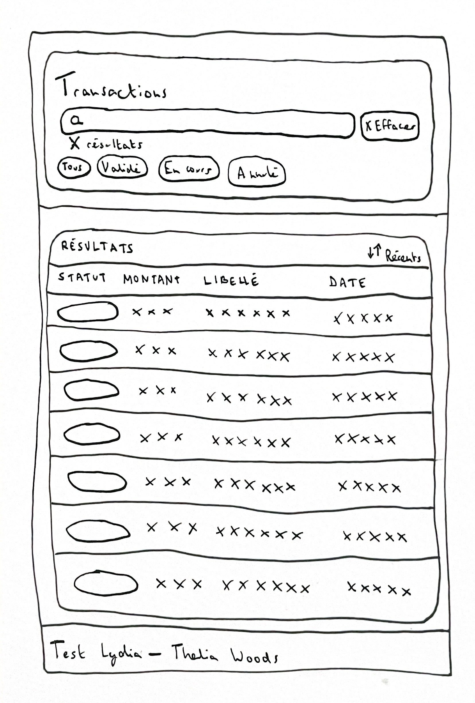

# Lydia — Transactions Search

Ce projet est une **Single Page Application React** réalisée dans le cadre du **test technique front-end Lydia**.

L’objectif était de concevoir une interface **claire, fluide et agréable à utiliser**, capable de faciliter la recherche au sein d’une liste de transactions à partir d’un fichier JSON fourni.

Une attention particulière a été portée à la **qualité de l’expérience utilisateur**, à la **cohérence visuelle**, à l’**accessibilité**, ainsi qu’à la **lisibilité du code**.

---

## Fonctionnalités

L’application permet de rechercher rapidement une transaction à partir de son libellé. La recherche est **insensible à la casse** et les résultats sont **mis à jour en temps réel**.

Un bouton **Effacer** accompagne le champ de recherche. Il est volontairement désactivé lorsque le champ est vide, puis devient actif dès qu’une saisie est effectuée.

Un système de **filtres par statut** permet d’affiner les résultats selon leur état (tous, validé, en cours, annulé). Ces filtres ont été pensés comme un prolongement de la recherche textuelle.

Les résultats sont présentés sous forme de liste structurée, affichant pour chaque transaction son **statut**, son **montant**, son **libellé** et sa **date**.

Lorsque la recherche ne retourne aucun élément, un **état vide dédié** est affiché afin de conserver une expérience claire, explicite et rassurante pour l’utilisateur.

---

## UI / UX

L’interface a été conçue pour rester **sobre, lisible et orientée produit**.

La hiérarchie visuelle suit un enchaînement simple et logique : **recherche → filtres → résultats**.

Les composants sont réutilisables, découplés, et pensés pour évoluer facilement.

---

## Accessibilité

L’interface a été pensée pour rester **utilisable au clavier**, lisible et compréhensible, avec des **états explicites** (recherche, filtres, état vide) et une hiérarchie visuelle claire. L’objectif est d’intégrer l’accessibilité comme une composante naturelle de l’expérience, au même titre que le design ou la performance.

---

## Wireframes & démarche UX

Avant l’implémentation, j’ai réalisé plusieurs **wireframes à la main** afin de réfléchir à la structure de l’interface, à la hiérarchie des informations et aux parcours utilisateurs.

Ces croquis m’ont permis de cadrer l’enchaînement des écrans, d’identifier rapidement les éléments inutiles, et de poser une base simple et lisible avant le développement.

### Wireframe (papier)

---

## Choix techniques

Le projet est construit avec **React** et **Vite**, en **JavaScript**, conformément à l’énoncé du test.

Le styling repose sur **Tailwind CSS**, choisi pour sa rapidité de mise en place, sa cohérence visuelle et sa facilité de maintenance.

La logique de recherche a été implémentée **sans librairie externe**, comme demandé.  
Elle s’appuie notamment sur une approche par **n-grammes**, permettant d’améliorer la pertinence des résultats tout en conservant de bonnes performances, même lorsque l’utilisateur saisit des libellés partiels.

L’application est structurée autour de composants clairs (`SearchInput`, `Status`, `TransactionsTable`), chacun ayant une responsabilité bien définie.

---

## Tests

Des tests end-to-end avec Playwright ont été ajoutés pour sécuriser les parcours clés.

Ils couvrent notamment :
- recherche insensible à la casse,
- recherche vide (liste non vide + compteur visible),
- comportement du bouton Effacer (disabled / actif / reset),
- affichage de l’état vide quand aucun résultat,
- filtrage par statut.

Lancer les tests e2e :
    npm run test:e2e

Interface graphique Playwright :
    npm run test:e2e:ui

---

## Installation & lancement

Prérequis :
- Node.js >= 20
- npm

Installation :
    npm install

Lancer le projet en local :
    npm run dev

Build de production :
    npm run build
    npm run preview

---

## CI / CD

- GitHub Actions : workflow e2e Playwright
- Vercel : déploiement automatique à chaque push

Application déployée :
    https://test-lydia.vercel.app
